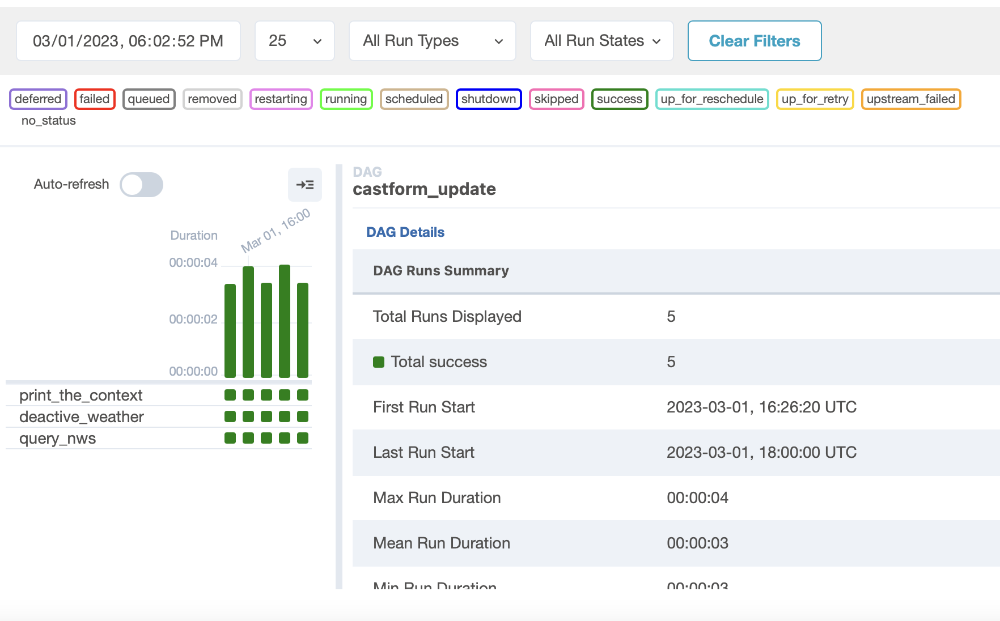
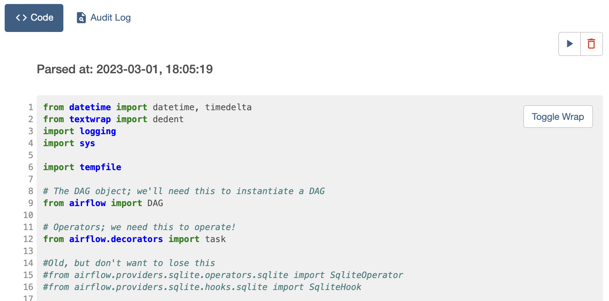
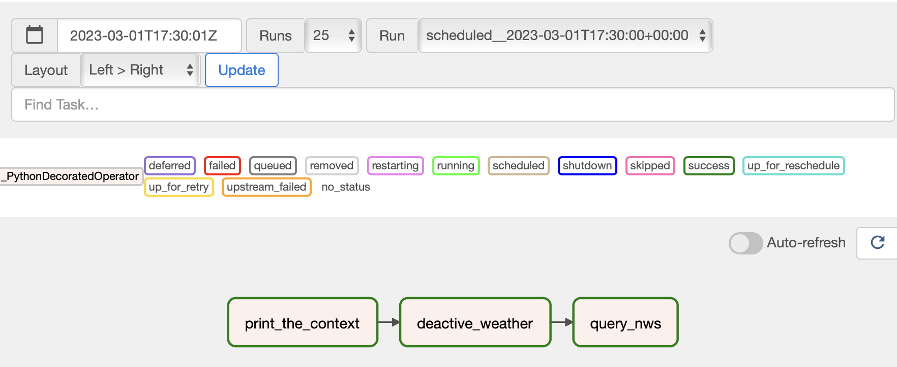
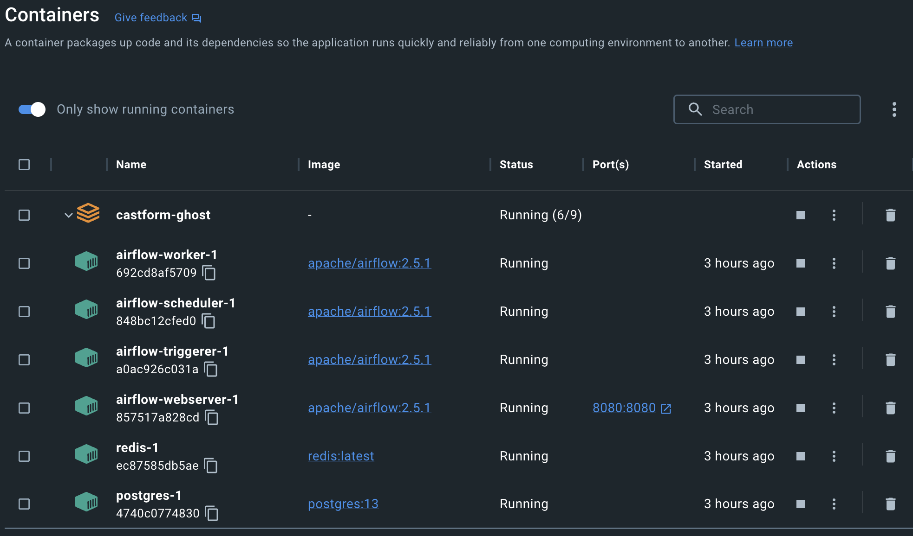

# Airflow via Docker: Lessons Learned
#### Last Updated: March 1, 2023
---

## Airflow
### What is Airflow?
<a href="https://airflow.apache.org/docs/apache-airflow/stable/index.html">Apache Airflow</a> is an open-source batch-oriented task orchestration platform. Airflow reads from Python-based DAGs (directed acyclic graph) in order to execute batch tasks as a workflow on a schedule.  

### What is cool about Airflow?
* Flexible task orchestration based on user-defined DAGs
  * Can leverage jinja templating
* Robust logging + task monitoring capabilities
* Can store sensitive environment variables (ex: API keys) in platform + reference in a DAG
* Can support multiple user access
* Embraced by open-source community, lots of resources are available

### What are some challenges with Airflow?
* Needs 4GB of memory to run
  * This can make cloud deployment pricy for personal use
* DAG writing can be complicated for new Python users
  * Uses cron schedules, which can be complex
* Needs active server space, whether local or remote
* Airflow is meant for batch workflows - is not built to handle real-time data processing

## Docker
### What is Docker?
<a href="https://docs.docker.com/get-started/overview/">Docker</a> is an open-source platform to containerize applications. By storing an application in a container, it contains all of the necessary dependencies needed to run regardless of the location of the container (ex: local, cloud).

### What is cool about Docker?
* Desktop client is available to manage containers
* Docker can be quickly spun up/shut down via CLI
* Docker can control the resources allocated to containers (ex: partitioning resources)
* Docker can ensure consistency in application deployment + dependencies across multiple users or locations (ex: local, remote)

### What are some challenges with Docker?
* Can be very difficult to set up depending on the application
* Can be very difficult to deploy - needs DevOps experience
* Docker isolates application from local file system, so locating local resources (ex: files) can be difficult

## Deploying Airflow in Docker
### Why deploy Airflow in Docker?
By containerizing Airflow in Docker, it is possible to:
* Constrict the resources Airflow has access to, both in file storage and compute utilization
* Deploy Airflow to remote server or cloud compute environments (ex: EC2)
  * This can facilitate multiple user access
* Change Airflow configurations with a lower level of effort

<a href="https://airflow.apache.org/docs/apache-airflow/stable/howto/docker-compose/index.html">Airflow provides documentation + resources on how to set up Airflow in Docker.</a>

## Screenshots
Example Airflow DAG Status:

Example Airflow DAG Structure:

Example Airflow Task Workflow:

Example Docker Containers for Airflow:
